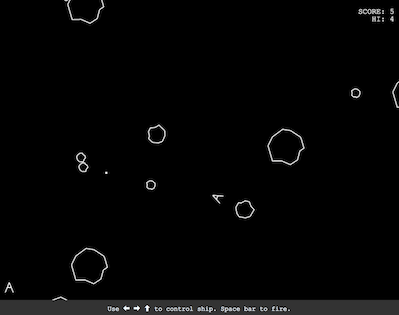

# Rock Blaster

**Classic arcade revival in HTML5 + TypeScript** 

## Install

The project uses Webpack 4.

`$ npm install`

If you get the following error:

`npm ERR! Invalid package name "@babel-core": name can only contain URL-friendly characters`

Run the following command:

`$ npm -i @babel/core`

## Run

Launch with hot reload thanks to `webpack-dev-server`:

`$ npm start`

## Build

Build the project in the `build` directory:

`$ npm run-script build`

## Known limitations and issues

* Keyboard required (you cannot play on a tablet)
* No sound on Safari
* Security vulnerability warning on `hoek`. No fix from `node-sass` yet.

## Credits

* Original game largely inspired from
[Asteroid Deluxe](https://www.arcade-history.com/?n=asteroids-deluxe&page=detail&id=127)
* Sounds downloaded from [classicgaming.cc](http://www.classicgaming.cc/classics/asteroids/sounds)
 
